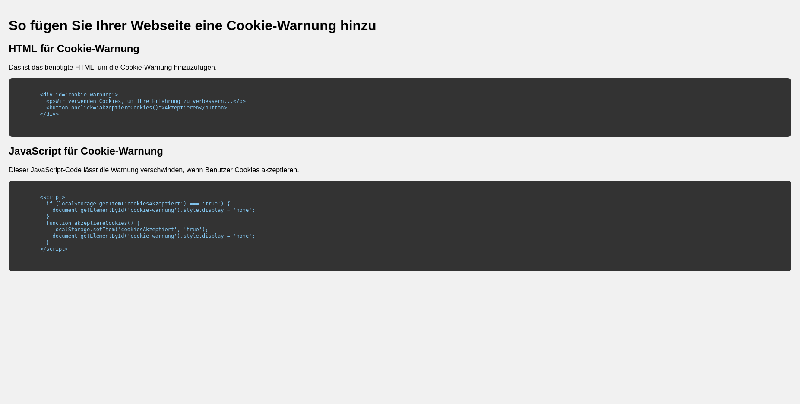

# Cookie-Warnung für Ihre Webseite

Dieses Repository enthält den Code für eine einfache Cookie-Warnung, die in jede Webseite integriert werden kann.

## Features

- Einfach zu integrieren
- Responsives Design
- Verwendung von `localStorage` für die Zustimmungsverwaltung

## Installation

Kopieren Sie einfach den HTML-, CSS- und JavaScript-Code aus der `index.html`-Datei in Ihre eigene Webseite.

## Verwendung

Sobald der Code in Ihre Webseite integriert ist, wird die Cookie-Warnung am unteren Bildschirmrand angezeigt. Benutzer können diese durch Klicken auf "Akzeptieren" entfernen. Ihre Auswahl wird im `localStorage` gespeichert und die Warnung wird bei zukünftigen Besuchen nicht erneut angezeigt.

## Autor

[Dein Name](https://github.com/pacnimo)

## Lizenz

Dieses Projekt steht unter der MIT-Lizenz - siehe die [LICENSE.md](LICENSE.md) Datei für Details.

---

Für weitere Informationen, bitte das [Wiki](https://github.com/pacnimo/Cookie-Warnung/wiki) besuchen.

